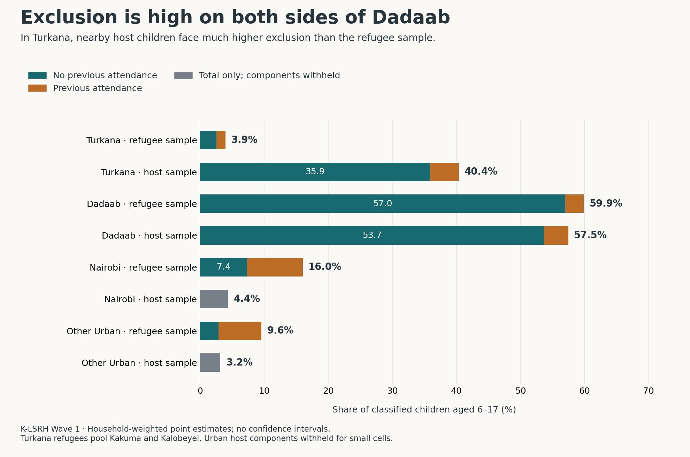
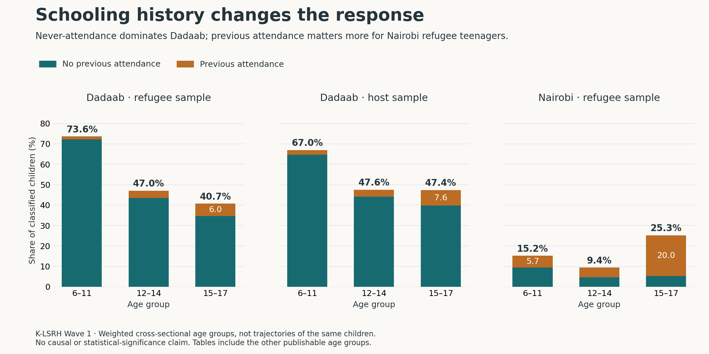
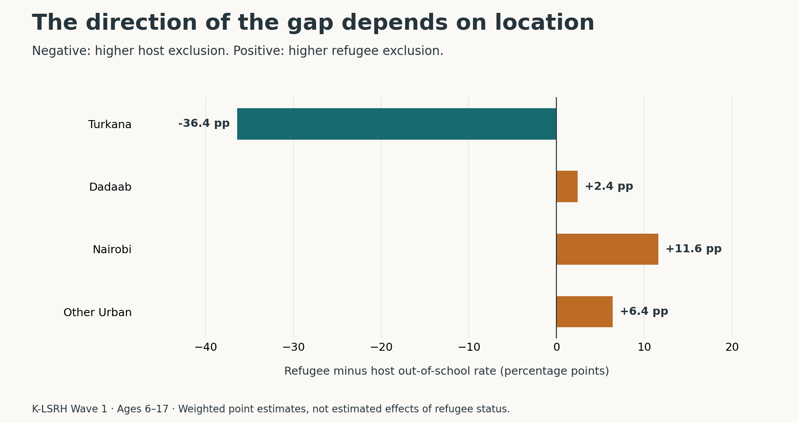

# Schooling exclusion follows different patterns across Kenya’s refugee-hosting communities

**Dadaab’s exclusion is predominantly a first-entry problem. Turkana’s largest disadvantage is among nearby host children. In Nairobi’s refugee sample, previous attendance accounts for most exclusion among older teenagers.**

I analysed 16,472 children aged 6–17 in the K-LSRH household roster, separating children out of school with no previous attendance from those who had attended before. I used the survey’s household weights and compared refugee and host samples within each supported location. The results point to different priorities for outreach and follow-up; one pooled refugee–host average would obscure them.

## High exclusion can coexist with a small refugee–host gap

In Dadaab, **59.9% of refugee-sample children and 57.5% of host-sample children** were out of school. The gap was only **2.4 percentage points**, but both groups faced high exclusion. Never-attendance accounted for **95.2% and 93.4%**, respectively, of their out-of-school populations. A programme focused only on returning former pupils would miss most excluded children in these samples.

Turkana showed a different comparison: **40.4% among nearby hosts versus 3.9% in the pooled Kakuma/Kalobeyei refugee sample**. Never-attendance contributed **33.4 points of the 36.4-point host disadvantage**. The descriptive priority is to include host communities explicitly in first-entry outreach; these data do not establish why the gap exists.



| Location and sample | Children analysed* | Out of school: never attended | Out of school: attended before | Total out of school |
|---|---:|---:|---:|---:|
| Turkana — refugees | 6,409 | 2.6% | 1.4% | **3.9%** |
| Turkana — hosts | 1,441 | 35.9% | 4.5% | **40.4%** |
| Dadaab — refugees | 2,933 | 57.0% | 2.9% | **59.9%** |
| Dadaab — hosts | 2,726 | 53.7% | 3.8% | **57.5%** |
| Nairobi — refugees | 1,147 | 7.4% | 8.7% | **16.0%** |
| Nairobi — hosts | 549 | Withheld | Withheld | **4.4%** |
| Other Urban — refugees | 727 | 2.9% | 6.7% | **9.6%** |
| Other Urban — hosts | 539 | Withheld | Withheld | **3.2%** |

*Unweighted classified denominators; percentages are weighted. One additional Turkana host child remains unclassified. Both components are withheld for urban host samples because of small cells; totals remain available. Rounded components may not sum to the rounded total. “Other Urban” combines the survey’s Nakuru/Mombasa coverage. [Download estimates](outputs/schooling_estimates.csv).

## Schooling history changes the practical response

Among Dadaab refugee children aged 6–11, **72.3% had never attended and were out of school**, compared with **1.3% who had attended before**. In the host sample, these components were **64.7% and 2.3%**. First-entry assessment therefore deserves a distinct place in the response, including checking placement needs and the barriers families report.

Nairobi refugee teenagers aged 15–17 had a different profile: **25.3% were out of school**, comprising **20.0% with previous attendance** and **5.2% with none**. Previous attendance accounted for **79.3%** of exclusion in this age group. That makes re-entry support and investigation of interrupted schooling particularly relevant alongside first-entry work.



These age groups contain different children observed in one survey wave. The lower never-attendance share among older Dadaab children does not show that the younger children subsequently entered school. Nor does previous attendance establish when, where or why schooling stopped, or that a child will remain out permanently.

## Location matters more than a single headline gap



| Planning implication | Evidence behind it | What the evidence does not establish |
|---|---|---|
| Include both refugee and host children in Dadaab first-entry outreach | High exclusion and predominantly never-attendance in both samples | The cause of non-entry or the effectiveness of an intervention |
| Include nearby Turkana hosts explicitly in access planning | Host exclusion exceeds refugee-sample exclusion by 36.4 points | A causal benefit of camp residence or a county-wide rate |
| Give Nairobi refugee teenagers a separate re-entry pathway | Previous attendance accounts for 20.0 of the 25.3 percentage points of exclusion at ages 15–17 | A longitudinal dropout rate, timing of exit, or individual eligibility |

These are priorities for assessment and programme design, not measured programme outcomes. The survey does not justify allocating budgets from percentage gaps alone: the size of the target population, current service capacity and implementation costs also matter.

## Checks that affect interpretation

- **Enrolment is not attendance on interview day.** The primary measure uses the released out-of-school-system indicator. Current enrolment and plans to enrol at reopening are included in the school system, even when a child was not attending at interview.
- **The main findings survive a stricter exit definition.** Including reported permanent exits or no plan to return after holidays adds 59 children to the out-of-school category. Across the eight location/sample groups, rates change by at most **1.2 percentage points**, with no reversal in the direction of a refugee–host gap.
- **Sample labels are taken from the released location strata.** Six children have a conflicting household-respondent status label. Excluding them changes any overall rate by less than **0.02 percentage points**.
- **The unresolved record has little numerical influence.** The Turkana host out-of-school rate lies between **40.34% and 40.43%** if that record is assigned either way. This is a missing-classification bound, not a confidence interval.

The estimates describe the survey’s supported populations in 2022–2023, not all Kenyan children or current conditions. They are weighted point estimates; no statistical-significance or causal claims are made. The World Bank’s original report already discussed never-attendance. This analysis adds a fixed 6–17 population, a common-denominator decomposition, age comparisons and explicit sensitivity checks. [Definitions, provenance and limitations](docs/methodology.md).

## Reproduce the analysis

Obtain the data through the [free World Bank access process](raw/README.md); microdata are not distributed in this repository. Use Python 3.12 from this directory:

```sh
python -m pip install -r requirements.txt
python -m unittest discover -s tests -v
# Complete the evidence-based validation file for your approved local release.
cp validation.example.json validation.json
python scripts/analyze.py --data raw/release/hhm.dta --validation validation.json --out outputs/private_run01
python scripts/robustness.py --data raw/release/hhm.dta --validation validation.json --out outputs/private_run01
# Review diagnostics and disclosure before preparing public tables and figures.
python scripts/build_release.py --private outputs/private_run01
python scripts/verify_release.py --data raw/release/hhm.dta --private outputs/private_run01
```

The figures are generated directly from the weighted estimates. [Quality checks](docs/qa.md), [calculation specification](docs/protocol.md), [source evidence](docs/evidence_review.md), and [input/output hashes](outputs/release_manifest.json) document the calculation. AI assisted with code and drafting; claims are tied to the released data and reproducible calculations.
